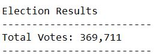
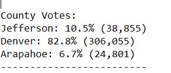
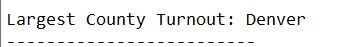
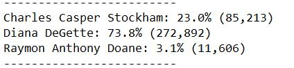
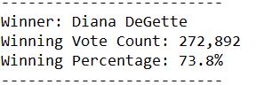

# Election_Analysis

## Overview of Election Audit
We would like to deliver the following informatio when the script is run:
-Total number of votes cast
-A complete list of candidates who received votes
-Total number of votes each candidate received
-Percentage of votes each candidate won
-The winner of the election based on popular vote
-The voter turnout for each county
-The percentage of votes from each county out of the total count
-The county with the highest turnout

## Election Audit Results
*How many votes were cast in this congressional election? 

*Provide a breakdown of the number of votes and the percentage of total votes for each county in the precinct.

*Which county had the largest number of votes?

*Provide a breakdown of the number of votes and the percentage of the total votes each candidate received.

*Which candidate won the election, what was their vote count, and what was their percentage of the total votes?

## Election Audit Summary
Two examples of how this script can be modified to be used for other elections.

1) If we would like to understand the demographic of the voters, we could create a variables that represent age groups and also a dictionary for age groups (e.g. 1 to 10) and run a for loop with an if function to determine which age groups they belong to first, and then use the for loop and an if functin to gothrough all the rows to increase the votes from different age groups. Finally, we will be able to tell which age groups contributed the most to the total votes being casted.

2) If we would like to know the education levels of the voters, use the same method we used for candidate_votes and county_votes analysis to get the spread of the education level of the voters.
